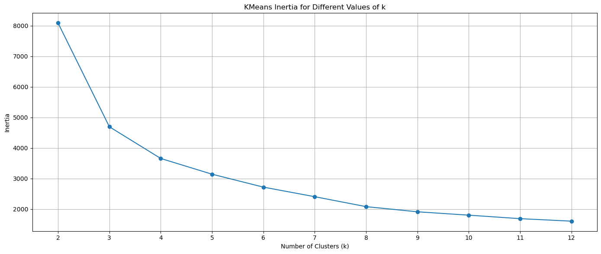
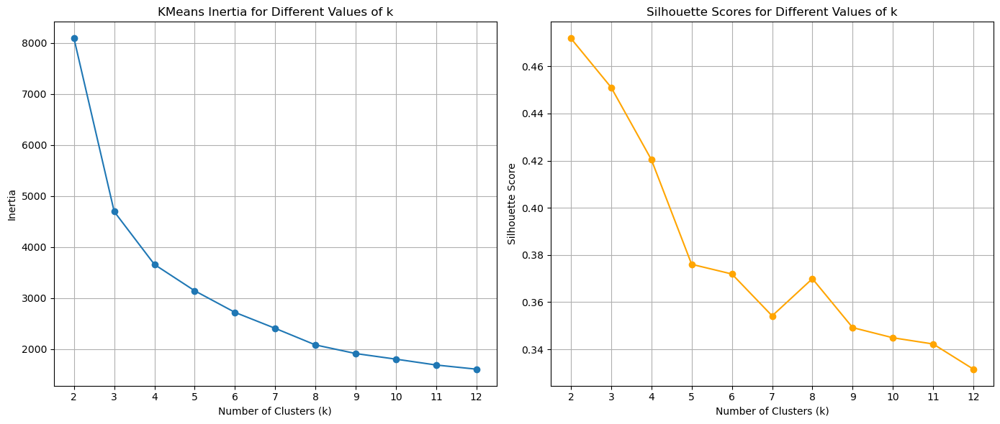
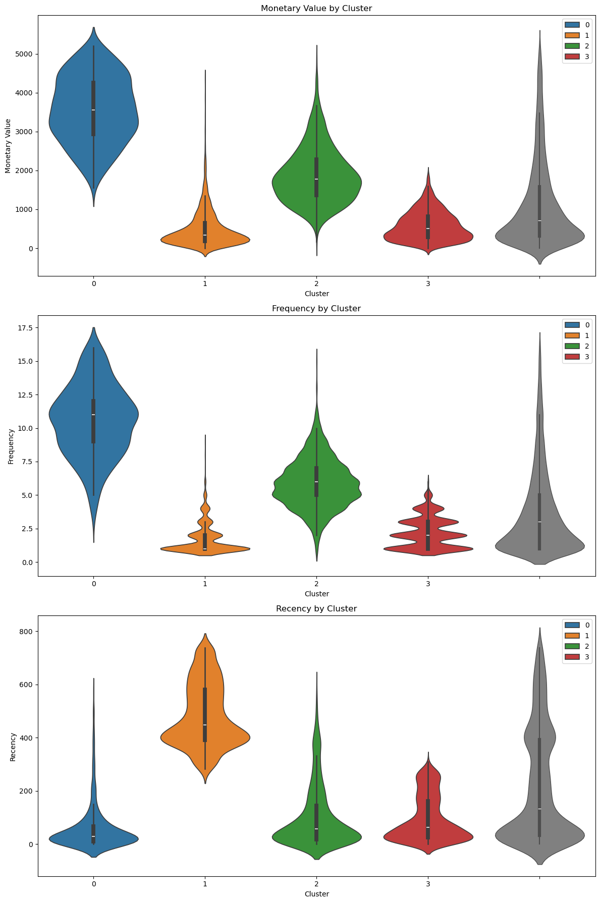
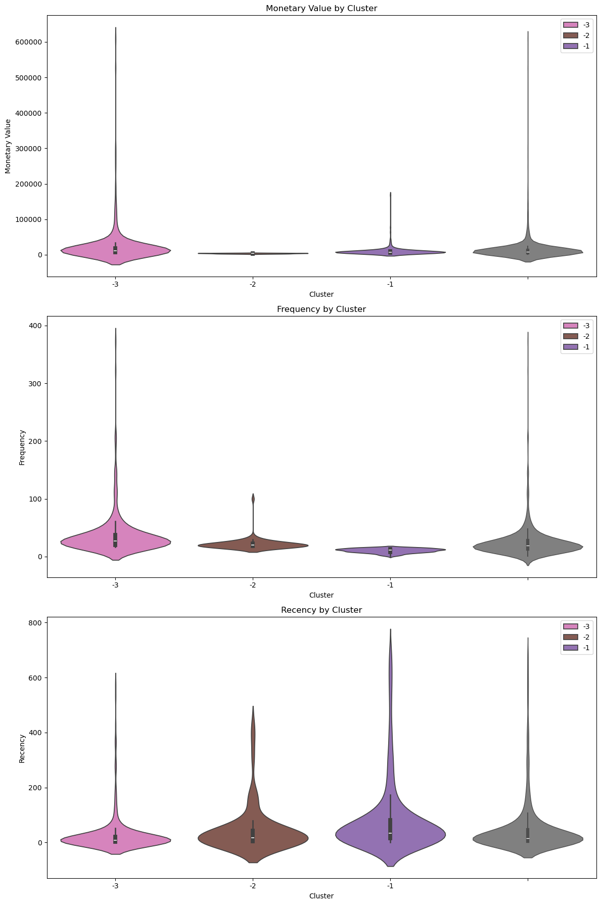
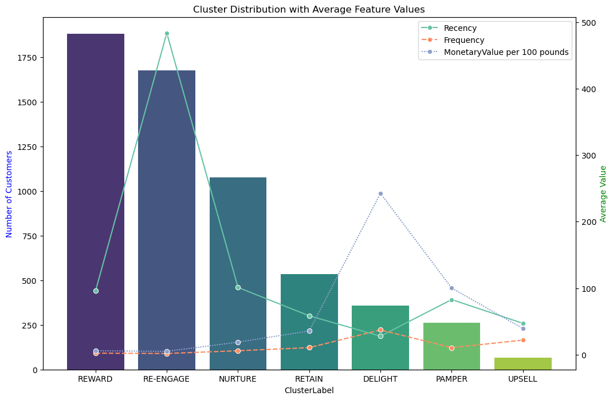

## **Customer Segmentation Analysis Report**
 ### **Introduction**
In a rapidly evolving business world, understanding customer behavior is critical for success. However, not all customers are the same—some are loyal and high-spending, while others may be infrequent or disengaged. To address this diversity, businesses need a data-driven approach to segment customers and tailor strategies to their specific needs.  

This project tackles customer segmentation by analyzing a **real-world retail dataset** with over **1 million transactions**, using **RFM Analysis** (Recency, Frequency, and Monetary value) and **K-Means Clustering**. The result? Clear, actionable insights that empower businesses to drive engagement, optimize marketing strategies, and increase revenue.  

**Goal of the Analysis**

To segment customers into meaningful groups and answer key business questions:  
1. Who are the most valuable customers?  
2. How can we re-engage inactive customers?  
3. Which groups should be targeted for upselling or loyalty programs?

### **Dataset Overview**
- **Source:** The data is from a UK-based online retailer.  
- **Scope:** Covers two years of transactional data(**2009–2011**).  
- **Size:** Over **1,067,371** transactions, covering various customer purchase behaviors.  
- **Features:** **8 variables**, including transactional details, customer attributes, and product information.

#### **Data Dictionary:**

| **Feature**     | **Description**                              | **Type**            |
|------------------|----------------------------------------------|---------------------|
| **InvoiceNo**    | Unique transaction ID (C-prefix for cancellations). | Categorical         |
| **StockCode**    | Unique product ID.                          | Categorical         |
| **Description**  | Product name.                               | Textual             |
| **Quantity**     | Number of units purchased.                  | Numeric (Real)      |
| **InvoiceDate**  | Transaction date/time.                      | Time-series         |
| **UnitPrice**    | Price per product (£).                      | Numeric (Real)      |
| **CustomerID**   | Unique customer ID.                         | Categorical         |
| **Country**      | Customer's country of residence.            | Categorical         |


### **Methodology**
#### **1. Data Inspection**
**Code Snippet: Data Inspection with Regex**
```python
#Filter for NA in Cthe ustomer ID
df[df["Customer ID"].isna()].head()
```

```python
#Filter for Quantity less than 0
df[df['Quantity']< 0 ].head()
```
```python
# Correct Invoices filter
df['Invoice'] = df['Invoice'].astype('str')
df[df['Invoice'].str.match("^\\d{6}$") == True]
```
```python
# Inorrect or weird Invoices filter
df['Invoice'] = df['Invoice'].astype('str')
df[df['Invoice'].str.match("^\\d{6}$") == False]
```
```python
# Correct StockCode filter
df['StockCode'] = df['StockCode'].astype('str')
df[df['StockCode'].str.match("^\\d{5}$") == False]
```
#### **2. Data Cleaning and Preparation**
- **Handling Missing Data:** Removed rows with null `CustomerID` values.  
- **Filtering Cancellations:** Excluded transactions labeled as canceled (`InvoiceNo` starting with 'C').  
- **Outlier Detection:** Capped anomalies in `Quantity` and `UnitPrice` to maintain robust analysis.  

**Code Snippet: Data cleaning**
```python
# Removing incorrect invoices
cleaned_df['Invoice'] = cleaned_df['Invoice'].astype('str')
mask = (
    cleaned_df['Invoice'].str.match("^\\d{6}$") == True
)

cleaned_df = cleaned_df[mask]
cleaned_df.head()
```

```python
# Cleaning StockCodes
cleaned_df['StockCode'] = cleaned_df['StockCode'].astype('str')
mask = (
    (cleaned_df["StockCode"].str.match("^\\d{5}$") == True)
    | (cleaned_df["StockCode"].str.match("^\\d{5}[a-zA-Z]+$") == True)
    | (cleaned_df["StockCode"].str.match("^PADS$") == True)
)
cleaned_df = cleaned_df[mask]
cleaned_df.head()
```

```python
cleaned_df.dropna(subset=['Customer ID'], inplace=True)
```
```python
# Remove outliers
M_Q1 = aggregated_df["MonetaryValue"].quantile(0.25)
M_Q3 = aggregated_df["MonetaryValue"].quantile(0.75)
M_IQR = M_Q3 - M_Q1

monetary_outliers_df = aggregated_df[(aggregated_df["MonetaryValue"] > (M_Q3 + 1.5 * M_IQR)) | (aggregated_df["MonetaryValue"] < (M_Q1 - 1.5 * M_IQR))].copy()

monetary_outliers_df.describe()
```
```python
F_Q1 = aggregated_df['Frequency'].quantile(0.25)
F_Q3 = aggregated_df['Frequency'].quantile(0.75)
F_IQR = F_Q3 - F_Q1

frequency_outliers_df = aggregated_df[(aggregated_df['Frequency'] > (F_Q3 + 1.5 * F_IQR)) | (aggregated_df['Frequency'] < (F_Q1 - 1.5 * F_IQR))].copy()

frequency_outliers_df.describe()
```
```python
non_outliers_df = aggregated_df[(~aggregated_df.index.isin(monetary_outliers_df.index)) & (~aggregated_df.index.isin(frequency_outliers_df.index))]
non_outliers_df.head()
```
#### **3. Feature Engineering**
**Computed RFM Metrics:**  
- **Recency (R):** Days since the last transaction.  
- **Frequency (F):** Number of transactions per customer.  
- **Monetary Value (M):** Total revenue contributed by each customer.  

**Code Snippet: RFM Calculation**
```python
# Calculate Recency, Frequency, and Monetary metrics
cleaned_df['SalesLineTotal'] = cleaned_df['Quantity']* cleaned_df['Price']
```
```python
aggregated_df = cleaned_df.groupby(by='Customer ID', as_index=False)\
    .agg(
        MonetaryValue=('SalesLineTotal', 'sum'),
        Frequency=("Invoice", 'nunique'),
        LastInvoiceDate=("InvoiceDate", "max")
    )
    
aggregated_df.head()
```
```python
# Ensure 'LastInvoiceDate' is in datetime format
aggregated_df['LastInvoiceDate'] = pd.to_datetime(aggregated_df['LastInvoiceDate'])

# Ensure 'max_invoice_date' is also in datetime format
max_invoice_date = aggregated_df['LastInvoiceDate'].max()

# Calculate 'Recency' in days
aggregated_df['Recency'] = (max_invoice_date - aggregated_df['LastInvoiceDate']).dt.days
aggregated_df.head()

```

#### **4. K-Means Clustering**
- **Feature Scaling:** Standardized RFM metrics using **Z-Score Scaling** to ensure equal contribution to clustering.  
- **Optimal Cluster Selection:**  
  - **Elbow Method:** Determined the "elbow point" at **k = 4** clusters.  
  - **Silhouette Analysis:** Verified clustering quality and distinctness for k = 2–4.  
- **Cluster Assignment:** Grouped customers into distinct segments for profiling.

**Code Snippet: K-Means Clustering**
```python
from sklearn.cluster import KMeans
from sklearn.preprocessing import StandardScaler
# Standardize RFM values
scaler = StandardScaler()
scaled_data = scaler.fit_transform(non_outliers_df[["MonetaryValue", "Frequency", "Recency"]])
scaled_data

scaled_df = pd.DataFrame(scaled_data, non_outliers_df.index, columns=("MonetaryValue", "Frequency", "Recency"))
scaled_df

# Apply K-Means Clustering
kmeans = KMeans(n_clusters=4, random_state=42, max_iter=1000)
cluster_labels = kmeans.fit_predict(scaled_df)
cluster_labels

non_outliers_df["Cluster"] = cluster_labels
non_outliers_df

```


### **Visualizations**
1. **Elbow Method Plot:** Shows the optimal number of clusters at **k = 4**. 

2. **Silhouette Scores Plot:** Highlights clustering quality and separation. 


3. **Violin Plots:** Illustrate the recency, frequency, and monetary values distribution within each cluster.
 - Clusters with Outliers 


- Clusters without Outliers 


4. **Customers Cluster Profile:** Provides Cluster Distribution with Average Feature Values


### **Key Insights**
1. **Largest Clusters:**
   - **REWARD (~1900 customers):** Semi-active, high recency, low frequency, and low spending.  
   - **RE-ENGAGE (~1700 customers):** Long-inactive, low engagement, minimal spending.  

2. **High-Value Clusters:**
   - **DELIGHT:** High frequency and spending; most engaged and valuable customers.  
   - **UPSELL:** Recent, frequent, and high-spending customers; ideal for upselling.  

3. **Mid-Value Clusters:**
   - **NURTURE:** Moderate recency and spending; potential for growth.  
   - **RETAIN:** Actively engaged with moderate frequency and spending; needs retention efforts.  

4. **Low-Value Cluster:**
   - **PAMPER:** Low engagement but moderate spending; offers growth potential via upselling.

### **Recommendations**
1. **RE-ENGAGE & REWARD:**  
   - Reactivate inactive and semi-active customers with win-back campaigns, discounts, and reminders.

2. **DELIGHT & UPSELL:**  
   - Retain loyal, high-spending customers through exclusive rewards, VIP perks, and personalized offers.  

3. **NURTURE & PAMPER:**  
   - Encourage activity with targeted promotions, upselling strategies, and loyalty incentives.  

4. **RETAIN:**  
   - Prevent churn by maintaining engagement with regular, personalized communication.

### **Action Plan**
1. **For High-Value Clusters (DELIGHT & UPSELL):**  
   - Offer VIP programs, personalized product recommendations, and premium access events to maximize lifetime value.  

2. **For Inactive Clusters (REWARD & RE-ENGAGE):**  
   - Deploy retargeting ads, personalized “We Miss You” campaigns, and discounts to reactivate these groups.  

3. **For Mid-Value and Low-Value Clusters (NURTURE, RETAIN, PAMPER):**  
   - Promote affordable bundles, referral programs, and incentives to drive repeat purchases and higher spending.


### **Conclusion**
This analysis provides a roadmap for targeted marketing by segmenting customers into actionable groups. The results help businesses allocate resources effectively to maximize retention, reactivation, and growth opportunities.  
- **High-value clusters (DELIGHT & UPSELL)** drive significant revenue and require loyalty programs to sustain engagement.  
- **Inactive clusters (REWARD & RE-ENGAGE)** represent untapped opportunities that can be reactivated with strategic campaigns.  
- **Growth clusters (NURTURE & RETAIN)** offer the potential for increased spending with the right incentives.   

### **Key Takeaways**
1. **Retention Opportunities:** Prioritize high-value customers with VIP perks and tailored offers.  
2. **Reactivation Potential:** Target inactive customers with win-back campaigns and discounts.  
3. **Growth Potential:** Nurture mid-value clusters to increase spending and engagement.  
4. **Upselling Opportunities:** Unlock untapped revenue from low-frequency but moderate-spending customers.  

#### **Explore the Full Analysis**
- **📂 Full Jupyter Notebook:** [full_online_retail_cluster.ipynb](#)
